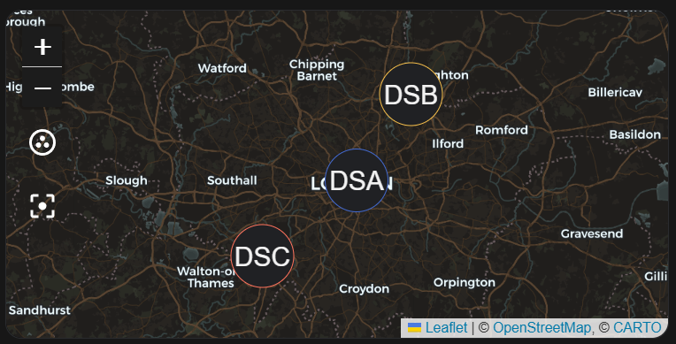
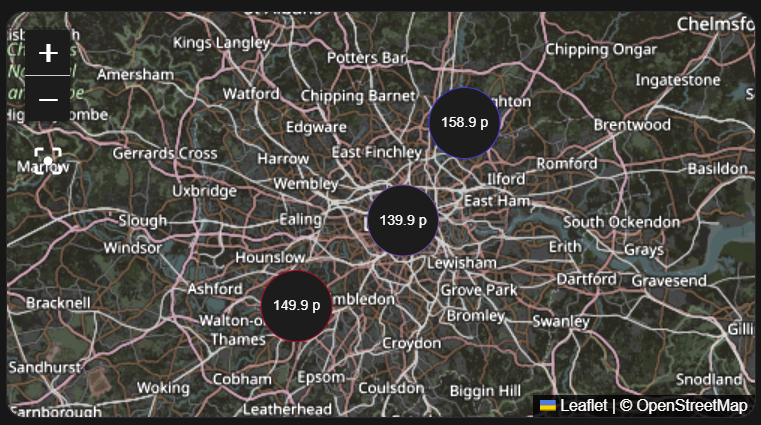
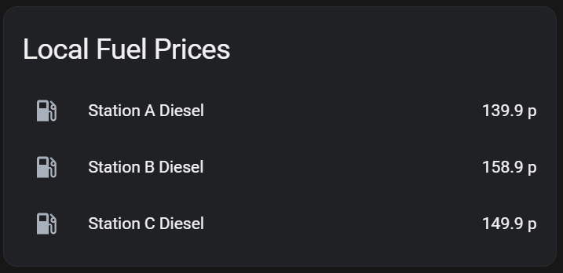
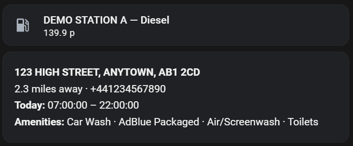
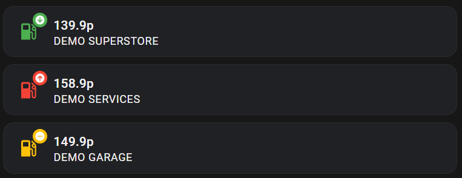
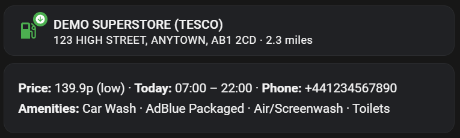

# UK Fuel Prices — Home Assistant Integration

[![hacs][hacsbadge]][hacs]
[![GitHub Release][releases-shield]][releases]
![Code Size][code-size]
[![License][license-shield]](LICENSE)

A Home Assistant custom integration that provides real-time UK fuel prices from the [UK Government Fuel Finder API](https://www.developer.fuel-finder.service.gov.uk/).

Each configured station appears as a Device in HA with individual sensors per fuel type. Sensors include station metadata, distance from home, and map support.

---

## Prerequisites

You need a **Fuel Finder developer account** to get API credentials:

1. Go to [developer.fuel-finder.service.gov.uk](https://www.developer.fuel-finder.service.gov.uk/)
2. Sign in with GOV.UK One Login (or create an account)
3. Register as an **Information Recipient**
4. Once approved, you'll receive a **Client ID** and **Client Secret**

---

## Installation

### Via HACS (recommended)

1. In HACS, go to **Integrations**
2. Click the three-dot menu → **Custom repositories**
3. Add `https://github.com/craigusus/ha-uk-fuel-prices` as an **Integration**
4. Search for **UK Fuel Prices** and install it
5. Restart Home Assistant

### Manual

1. Download this repository
2. Copy `custom_components/uk_fuel_prices/` to your HA `/config/custom_components/` folder
3. Restart Home Assistant

---

## Configuration

### Step 1 — Add the Integration

Go to **Settings → Devices & Services → Add Integration** and search for **UK Fuel Prices**.

Enter your **Client ID** and **Client Secret**. The integration will validate your credentials immediately.

### Step 2 — Add Stations

After the integration is set up, go to **Settings → Devices & Services → UK Fuel Prices → Configure**.

Select **"Search for a station by name"** and type part of the station name, brand (e.g. Tesco, BP, Shell), postcode, or town. The integration searches the full UK Fuel Prices database and shows matching stations with their brand, postcode, and town — just pick yours from the list.

For each station, select which fuel types to track (E10, Diesel, E5 Premium, Premium Diesel).

Repeat for each station. There is no limit on the number of stations.

> **Manual entry:** If you already know your station's batch number and node ID, choose **"Add a station manually"** instead.

### Editing a Station

To change which fuel types are tracked for an existing station, go to **Settings → Devices & Services → UK Fuel Prices → Configure** and select **"Edit: {station name}"** from the list. You can also do this directly from the station's device page via the **Configure** button.

### Removing a Station

To remove a station entirely, go to **Settings → Devices & Services → Devices**, find the station, open the **three-dot menu**, and select **Delete**. The station and all its sensors will be removed.

<details>
<summary>How to find batch number and node ID manually</summary>

1. Go to the [UK Fuel Prices API documentation](https://www.developer.fuel-finder.service.gov.uk/apis-ifr/info-recipent/docs)
2. Use the `GET /v1/pfs/fuel-prices` endpoint with `batch-number=1` through `15`
3. Search the response for your station by `trading_name`
4. Note the `node_id` and the batch number it was found in

</details>

---

## Sensors

Each station appears as a **Device** in Home Assistant with one sensor per selected fuel type:

| Sensor | Unit | Example |
|--------|------|---------|
| E10 Unleaded | p | 142.9 |
| E5 Premium Unleaded | p | 157.9 |
| Diesel | p | 165.9 |
| Premium Diesel | p | 183.9 |

Each sensor includes the following attributes:

**Price**
| Attribute | Description |
|---|---|
| `station_name` | Official trading name from the API |
| `fuel_type` | Raw fuel type identifier |
| `price_last_updated` | When the station last reported this price |
| `price_level` | `low`, `medium`, or `high` based on configurable thresholds |

**Location**
| Attribute | Description |
|---|---|
| `brand` | Fuel brand/retailer (e.g. Tesco, BP, Shell) |
| `address` | Station street address |
| `address_line_2` | Second address line |
| `city` | Town or city |
| `county` | County |
| `country` | Country (e.g. ENGLAND, WALES, SCOTLAND) |
| `postcode` | Station postcode |
| `phone` | Station phone number |
| `latitude` | Station latitude |
| `longitude` | Station longitude |
| `distance_miles` | Straight-line distance from your HA home location |

**Station Type**
| Attribute | Description |
|---|---|
| `is_motorway_service_station` | `true` if this is a motorway services |
| `is_supermarket_service_station` | `true` if this is a supermarket forecourt |
| `temporary_closure` | `true` if the station is temporarily closed |

**Opening Hours**
| Attribute | Description |
|---|---|
| `opening_hours` | Dict of open/close times for each day of the week + bank holidays |
| `opens_today` | Today's opening time (e.g. `07:00:00`) |
| `closes_today` | Today's closing time |
| `is_24_hours_today` | `true` if the station is open 24 hours today |

**Amenities**

Exposed as a single `amenities` dict with the following keys: `adblue_pumps`, `adblue_packaged`, `lpg_pumps`, `car_wash`, `air_pump_or_screenwash`, `water_filling`, `twenty_four_hour_fuel`, `customer_toilets`.

> All attributes beyond `station_name`, `fuel_type`, `price_last_updated`, and `price_level` are populated from the live API data on each refresh.

### Viewing Attributes

Attributes are visible in **Settings → Developer Tools → States** — search for your sensor and the full attribute list appears on the right. They can also be used in Lovelace cards, automations, and templates:

```yaml
{{ state_attr('sensor.my_station_diesel', 'distance_miles') }} miles away
{{ state_attr('sensor.my_station_diesel', 'brand') }}
```

### Price Level Thresholds

Go to **Settings → Devices & Services → UK Fuel Prices → Configure → Configure price thresholds** to adjust the low/high boundaries. The `price_level` attribute can be used in automations, conditional cards, or Mushroom card templates.

Defaults: **140p** (low/medium boundary) and **155p** (medium/high boundary).

### Update Interval

Go to **Settings → Devices & Services → UK Fuel Prices → Configure → Update interval** to change how often prices are fetched. Default is **30 minutes**. Accepts 5 minutes to 24 hours.

Rich station metadata (opening hours, amenities, address details) is fetched separately and cached for **24 hours**, regardless of the price update interval.

---
## Example Dashboard Cards

### Map Cards

**Map showing station locations:**


```yaml
type: map
entities:
  - sensor.demo_station_a_diesel
  - sensor.demo_station_b_diesel
  - sensor.demo_station_c_diesel
```

**[`custom:map-card`](https://github.com/nathan-gs/ha-map-card) card with price:**


```yaml
type: custom:map-card
entities:
  - entity: sensor.demo_station_a_diesel
    display: state
  - entity: sensor.demo_station_b_diesel
    display: state
  - entity: sensor.demo_station_c_diesel
    display: state
```

---

### Entity Cards

**Simple price list:**


```yaml
type: entities
title: Local Fuel Prices
entities:
  - entity: sensor.demo_station_a_diesel
    name: Station A Diesel
  - entity: sensor.demo_station_b_diesel
    name: Station B Diesel
  - entity: sensor.demo_station_c_diesel
    name: Station C Diesel
```

**Station detail with metadata:**


```yaml
type: vertical-stack
cards:
  - type: tile
    entity: sensor.demo_station_a_diesel
    name: DEMO STATION A — Diesel
  - type: markdown
    content: >
      **{{ state_attr('sensor.demo_station_a_diesel', 'address') }}, {{
      state_attr('sensor.demo_station_a_diesel', 'city') }}, {{
      state_attr('sensor.demo_station_a_diesel', 'postcode') }}**

      {{ state_attr('sensor.demo_station_a_diesel', 'distance_miles') }} miles
      away · {{ state_attr('sensor.demo_station_a_diesel', 'phone') }}

      **Today:**  Open 24 hours  {{
      state_attr('sensor.demo_station_a_diesel', 'opens_today') }} – {{
      state_attr('sensor.demo_station_a_diesel', 'closes_today') }} 

                **Amenities:** {{ available | join(' · ') }}
```

**Mushroom Template card with coloured icons depending on [`price_level`](https://github.com/craigusus/ha-uk-fuel-prices?tab=readme-ov-file#price-level-thresholds)** 


```yaml
type: grid
columns: 1
square: false
cards:
  - type: custom:mushroom-template-card
    entity: sensor.demo_station_a_diesel
    primary: "{{ states('sensor.demo_station_a_diesel') }}p"
    secondary: |
      {{ state_attr('sensor.demo_station_a_diesel', 'station_name') }}
    icon: mdi:gas-station
    icon_color: >
       {{
      'green' if l == 'low' else 'amber' if l == 'medium' else 'red' }}
    badge_icon: >
       {{
      'mdi:arrow-down-circle' if l == 'low' else 'mdi:minus-circle' if l ==
      'medium' else 'mdi:arrow-up-circle' }}
    badge_color: >
       {{
      'green' if l == 'low' else 'amber' if l == 'medium' else 'red' }}
    tap_action:
      action: more-info
  - type: custom:mushroom-template-card
    entity: sensor.demo_station_b_diesel
    primary: "{{ states('sensor.demo_station_b_diesel') }}p"
    secondary: |
      {{ state_attr('sensor.demo_station_b_diesel', 'station_name') }}
    icon: mdi:gas-station
    icon_color: >
       {{
      'green' if l == 'low' else 'amber' if l == 'medium' else 'red' }}
    badge_icon: >
       {{
      'mdi:arrow-down-circle' if l == 'low' else 'mdi:minus-circle' if l ==
      'medium' else 'mdi:arrow-up-circle' }}
    badge_color: >
       {{
      'green' if l == 'low' else 'amber' if l == 'medium' else 'red' }}
    tap_action:
      action: more-info
  - type: custom:mushroom-template-card
    entity: sensor.demo_station_c_diesel
    primary: "{{ states('sensor.demo_station_c_diesel') }}p"
    secondary: |
      {{ state_attr('sensor.demo_station_c_diesel', 'station_name') }}
    icon: mdi:gas-station
    icon_color: >
       {{
      'green' if l == 'low' else 'amber' if l == 'medium' else 'red' }}
    badge_icon: >
       {{
      'mdi:arrow-down-circle' if l == 'low' else 'mdi:minus-circle' if l ==
      'medium' else 'mdi:arrow-up-circle' }}
    badge_color: >
       {{
      'green' if l == 'low' else 'amber' if l == 'medium' else 'red' }}
    tap_action:
      action: more-info

```

**Mushroom Template card with coloured icons depending on [`price_level`](https://github.com/craigusus/ha-uk-fuel-prices?tab=readme-ov-file#price-level-thresholds) with address and distance and card with attributes**


```yaml
type: vertical-stack
cards:
  - type: custom:mushroom-template-card
    entity: sensor.demo_station_a_diesel
    primary: >-
      {{ state_attr('sensor.demo_station_a_diesel', 'station_name') }} ({{
      state_attr('sensor.demo_station_a_diesel', 'brand') }})
    secondary: >-
      {{ state_attr('sensor.demo_station_a_diesel', 'address') }}, {{
      state_attr('sensor.demo_station_a_diesel', 'city') }}, {{
      state_attr('sensor.demo_station_a_diesel', 'postcode') }} · {{
      state_attr('sensor.demo_station_a_diesel', 'distance_miles') }} miles
    icon: mdi:gas-station
    icon_color: >-
       {{
      'green' if l == 'low' else 'amber' if l == 'medium' else 'red' }}
    badge_icon: >-
       {{
      'mdi:arrow-down-circle' if l == 'low' else 'mdi:minus-circle' if l ==
      'medium' else 'mdi:arrow-up-circle' }}
    badge_color: >-
       {{
      'green' if l == 'low' else 'amber' if l == 'medium' else 'red' }}
    tap_action:
      action: more-info
  - type: markdown
    content: >-
      **Price:** {{ states('sensor.demo_station_a_diesel') }}p ({{
      state_attr('sensor.demo_station_a_diesel', 'price_level') }}) · **Today:**
      Open 24 hours{{ state_attr('sensor.demo_station_a_diesel',
      'opens_today')[:5] }} – {{ state_attr('sensor.demo_station_a_diesel',
      'closes_today')[:5] }} · **Phone:** {{
      state_attr('sensor.demo_station_a_diesel', 'phone') }}

                **Amenities:** {{
      av.items | join(' · ') if av.items else 'None listed' }}
```

---

## Troubleshooting

**Integration won't load / credentials rejected**
- Double-check your Client ID and Client Secret
- Ensure your developer account is approved as an Information Recipient

**Sensor shows unavailable**
- Check HA logs (Settings → System → Logs) and filter for `uk_fuel_prices`
- The API rate limits aggressive polling — avoid restarting HA repeatedly

**Station not found in search**
- Try searching by postcode or town instead of station name — trading names in the API can differ from signage (e.g. "PONTYPOOL SUPERSTORE" rather than "Tesco")
- If adding manually, verify the node ID (64 hex characters) and batch number (1–15) are correct

---

## Contributing

Please open an issue to discuss any changes.


[hacs]: https://github.com/custom-components/hacs
[hacsbadge]: https://img.shields.io/badge/HACS-Custom-orange.svg?style=for-the-badge
[license-shield]: https://img.shields.io/github/license/craigusus/ha-uk-fuel-prices.svg?style=for-the-badge
[releases-shield]: https://img.shields.io/github/release/craigusus/ha-uk-fuel-prices.svg?style=for-the-badge
[releases]: https://github.com/craigusus/ha-uk-fuel-prices/releases
[code-size]: https://img.shields.io/github/languages/code-size/craigusus/ha-uk-fuel-prices?style=for-the-badge